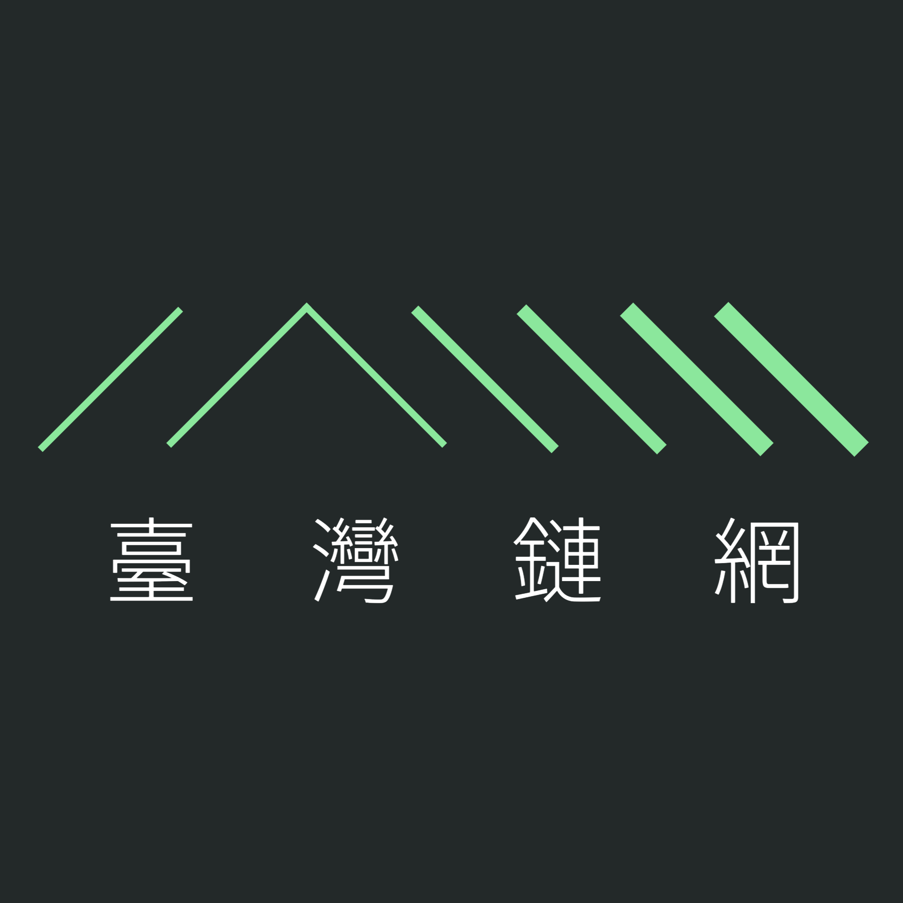

# 臺灣鏈網 Meshtastic Taiwan Community

![M-PWRD](https://img.shields.io/badge/powered-67EA94?style=for-the-badge&logo=data:image/svg+xml;base64,PD94bWwgdmVyc2lvbj0iMS4wIiBlbmNvZGluZz0iVVRGLTgiIHN0YW5kYWxvbmU9Im5vIj8+CjwhRE9DVFlQRSBzdmcgUFVCTElDICItLy9XM0MvL0RURCBTVkcgMS4xLy9FTiIgImh0dHA6Ly93d3cudzMub3JnL0dyYXBoaWNzL1NWRy8xLjEvRFREL3N2ZzExLmR0ZCI+Cjxzdmcgd2lkdGg9IjEwMCUiIGhlaWdodD0iMTAwJSIgdmlld0JveD0iMCAwIDUwIDI4IiB2ZXJzaW9uPSIxLjEiIHhtbG5zPSJodHRwOi8vd3d3LnczLm9yZy8yMDAwL3N2ZyIgeG1sbnM6eGxpbms9Imh0dHA6Ly93d3cudzMub3JnLzE5OTkveGxpbmsiIHhtbDpzcGFjZT0icHJlc2VydmUiIHhtbG5zOnNlcmlmPSJodHRwOi8vd3d3LnNlcmlmLmNvbS8iIHN0eWxlPSJmaWxsLXJ1bGU6ZXZlbm9kZDtjbGlwLXJ1bGU6ZXZlbm9kZDtzdHJva2UtbGluZWpvaW46cm91bmQ7c3Ryb2tlLW1pdGVybGltaXQ6MjsiPgogICAgPHN0eWxlPgogICAgICAgIEBtZWRpYSAocHJlZmVycy1jb2xvci1zY2hlbWU6IGRhcmspIHsKICAgICAgICAgICAgcGF0aCB7CiAgICAgICAgICAgICAgICBmaWxsOiB3aGl0ZTsKICAgICAgICAgICAgfQogICAgICAgIH0KICAgIDwvc3R5bGU+CiAgICA8ZyB0cmFuc2Zvcm09Im1hdHJpeCgxLjEwMTE2LDAsMCwwLjYzMTMyMSwtMjA3LjIyOCwtMjAyLjgzMykiPgogICAgICAgIDxnIHRyYW5zZm9ybT0ibWF0cml4KDAuMjAxODA0LDAsMCwwLjM1MTk4OSwxNjcuMjg5LDIxNi4wNjEpIj4KICAgICAgICAgICAgPHBhdGggZD0iTTI1MC45MTIsMzM0LjY2NEwxOTUuMTc1LDQxNi40MDNMMTc4Ljg4OSw0MDUuMjk3TDI0Mi43NTMsMzExLjY0QzI0NC41ODcsMzA4Ljk1IDI0Ny42MzEsMzA3LjMzOSAyNTAuODg3LDMwNy4zMzZDMjU0LjE0MywzMDcuMzMzIDI1Ny4xOSwzMDguOTM4IDI1OS4wMjksMzExLjYyNUwzMjMuMDQsNDA1LjEzNUwzMDYuNzc0LDQxNi4yN0wyNTAuOTEyLDMzNC42NjRaIi8+CiAgICAgICAgPC9nPgogICAgICAgIDxnIHRyYW5zZm9ybT0ibWF0cml4KDAuMjA1MDA5LDAsMCwwLjM1NzU3OCwxNzQuMjI0LDE1NC4yMjcpIj4KICAgICAgICAgICAgPHBhdGggZD0iTTg5Ljg3OCw1ODIuOTIzTDE1Ni45OTMsNDg0LjUwMkwxNDAuNDAyLDQ3My4xODhMNzMuMjg3LDU3MS42MDlMODkuODc4LDU4Mi45MjNaIi8+CiAgICAgICAgPC9nPgogICAgPC9nPgo8L3N2Zz4K)

<!-- markdownlint-disable -->
<!-- PROJECT LOGO -->
 

  
  <h3 align="center">臺灣鏈網 MeshTW</h3>
    

      <a href="https://meshtw.github.io/" tagret="_blank" rel="nofollow noopener"><strong>推廣網站 PR Website »</strong></a>
   

<!-- markdownlint-enable -->

## 我們是誰？ Who are we?

臺灣鏈網致力於推廣 Meshtastic 在臺灣的應用，
是由一衆熱衷於 Meshtastic 和網狀無線電通訊的愛好者組成的在地社群。
無論是應對自然災害、增強戶外活動安全，還是強化社區韌性，Meshtastic 都提供了一個值得探索和實踐的選擇。
我們相信網狀網絡的力量可以跨越地理界限，熱忱邀請您加入我們的行列，共同探索 Meshtastic 的無限可能。

MeshTW is a community-driven initiative that aims to leverage Meshtastic for
establishing off-grid communication networks in Taiwan.

We are a group of enthusiasts passionate about Meshtastic and mesh radio communication.
From disaster preparedness, outdoor safety, to strengthening community resilience,
Meshtastic provides a versatile and innovative solution.

We believe in the transformative power of mesh networks to connect people beyond
physical boundaries, and we are thrilled to invite you to join us in unlocking
the full potential of Meshtastic.

## 加入我們 Join Us

歡迎所有對 Meshtastic 和網狀無線電通訊感興趣的朋友加入社群！
無論是對 Meshtastic 的技術細節感興趣，還是想了解如何在日常生活中應用這項技術，
我們都期待與你一起參與活動、分享經驗並共同推動這項技術向前進。
隨時保持聯繫，讓我們攜手探索這個充滿可能性的領域！
我們的社群正在蓬勃發展，成員們熱情參與討論，並分享實踐經驗與心得。
請關注我們的社交媒體平台，隨時獲取最新消息和勸敗資訊。

Join the march towards a more connected and resilient future.
All are welcome to join us, regardless of your level of experience.
Keep in touch with us and explore the possibilities of this technology together!
Our community is thriving, with members actively engaging in discussions and sharing practical experiences. 
Follow us on social media platforms to stay updated with the latest info and gadget recommendations.

## 標誌意涵

<!-- markdownlint-disable -->

<!-- markdownlint-enable -->

標誌源自 Meshtastic 專案標誌，並透過四個部分延伸，將識別深化為兼具台灣地理、方向與人文的象徵景觀。

每一部分皆承載不同層次的意義，使標誌不僅是圖像，更是一套敘事系統。

- **六條山脈**

象徵五條縱貫全台的山脈 — **中央山脈**、**雪山山脈**、**玉山山脈**、**阿里山山脈**、**海岸山脈** 以及 **大屯火山彙**；
代表 **領航、清晰、穩健**，作為標誌性地景特徵，構成標識的骨架，並寓意 Meshstatic 節點提供穩固基礎。

- **島嶼與海岸**

象徵台灣的「外離島」、最高峰「玉山主峰」與「本島」東西南北海岸；
代表 **探索、追求與全方位**，展現均衡、堅韌，以及不斷追求巔峰的精神。

- **六條河川**

象徵台灣六條主要河川 — **濁水溪**、**高屏溪**、**淡水河**、**大甲溪**、**曾文溪**、**烏溪**（大肚溪）。
代表 **連續、聯繫、活力**，寓意 Meshstatic 網絡如同流經整個台灣地景的大動脈，連接山脈、地形與市鎮。

- **六種地形**

象徵台灣五大地形： **山地、丘陵、臺地、盆地、平原** 以及 **特殊地形**（火山地形、峽谷地形等）；
代表 **基礎、穩定與過渡**，連結高峰與平原，呈現多樣地勢，並連接周邊自然與人文區域。

- **六座都會**

象徵台灣六都 **台北、新北、桃園、台中、台南、高雄** — 承載標誌中的人文與社會層面。
代表 **組織、協作與交流**，讓標誌不僅寓意自然地景，也藴意資訊與互動匯聚的 Meshstatic 網絡。

四個部分將識別轉化為多層次的象徵地景。每一部分涵蓋自然與文化的平衡 — **島嶼與高峰、山脈與地形、河流與市鎮、方位與流動** —
最終凝聚為一個整體，象徵 **追求、堅韌與共同進步**。

## Brandmark Concept

<!-- markdownlint-disable -->

<!-- markdownlint-enable -->

The brandmark derives from the Meshtastic Project logo and evolves into a symbolic
landscape structured into **four interconnected sections**.
This framework extends the identity beyond a visual mark, embedding layers of meaning
that reflect geography, orientation, and community.

- **The Islands, the Highest Peak, and the Coasts**

This section embodies **exploration, aspiration, and orientation**,
encompassing Formosa versus the Outlying Islands, the Highest Peak - Mt. Jade Main Peak, and
the North-West-South-East regions and coasts, reflecting a balanced sense of guidance,
resilience, and the pursuit of summits.

- **Six Mountain Ranges**

Six symbolic mountain ranges — **Alishan Range**, **Central Mountain Range (Chungyang Range)**,
**Hai'an Range (Coastal Range)**, **Hsueshan Range**, **Yushan Range** and
**Tatun Volcanoes** — form the backbone of the landscape.
They represent **guidance, prominence, and reliance**, serving as landmarks of the landscape of Taiwan,
forms the backbone of the brandmark, and symbolizing the Meshtatic nodes provides a solid foundation.

- **Six Topographies**

Six symbolic topographies — **Mountains, Land Hills, Plateaus, Basins, Plains**,
and **special landforms** (e.g. volcanoes, groges, etc.).
They embody **foundation, stability, and transition**, ridging high peaks with lower plains, 
showcasing varied terrain and connecting the surrounding natural and cultural areas.

- **Six Riveres**

Six major river— **Zhuoshui River** (Danum Qalavang, Himeou ci Chumu), **Kaoping River**,
**Tamsui River**, **Dajia River** (Llyung Tmali), **Zengwen River**,
and **Wu River** (Dadu River) — meanders through the landscape of Taiwan.

They symbolise **continuity, connectivity, and vitality**,
embodying the Meshtastic network as arteries flowing through the landscape of Taiwan,
connecting mountains, topographies, and municipalities.

- **Six Municipalities**

The six Special Municipalities —
*Taipei, New Taipei, Taoyuan, Taichung, Tainan,* and *Kaohsuing* —
anchor the cultural and social dimension of the mark.

They stand for **organisation, cooperation, and community exchange**,
bringing a human scale into the broader landscape.
Through these six nodes, the brandmark becomes not only a natural geography
but also a **living network of people and cultural interaction**.

The sections above translate the brandmark into a multi-layered geography of symbols.
Each part represents natural and cultural elements in balance —
**islands and peaks, ranges and rivers, topographies and municipalities, orientation and continuity** —
ultimately unifying into a single mark of aspiration, resilience, and shared progress.
